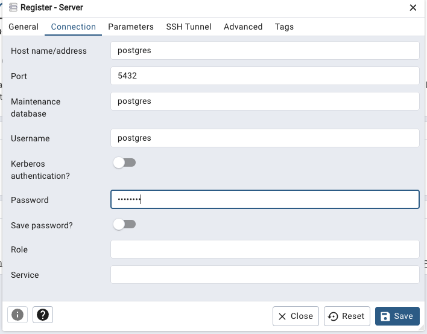

Q1. 
```bash
docker run -it --entrypoint bash python:3.12.8
```

```bash
pip -V
```
    


Q2.  Both actually work
    
    

Q3. 104,802; 198,924; 109,603; 27,678; 35,189

```sql
1. select count(*) from green_taxi_trip where lpep_pickup_datetime >= '2019-10-01' and lpep_dropoff_datetime < '2019-11-01' and trip_distance <= 1

2. select count(*) from green_taxi_trip where lpep_pickup_datetime >= '2019-10-01' and lpep_dropoff_datetime < '2019-11-01' and trip_distance > 1 and trip_distance <= 3

3. select count(*) from green_taxi_trip where lpep_pickup_datetime >= '2019-10-01' and lpep_dropoff_datetime < '2019-11-01' and trip_distance > 3 and trip_distance <= 7

4. select count(*) from green_taxi_trip where lpep_pickup_datetime >= '2019-10-01' and lpep_dropoff_datetime < '2019-11-01' and trip_distance > 7 and trip_distance <= 10

5. select count(*) from green_taxi_trip where lpep_pickup_datetime >= '2019-10-01' and lpep_dropoff_datetime < '2019-11-01' and trip_distance > 10
```

Q4. 2019-10-31
``` sql
select lpep_pickup_datetime from green_taxi_trip where trip_distance = (select max(trip_distance) from green_taxi_trip)
```

Q5. East Harlem North, East Harlem South, Morningside Heights

```sql
select tzl."Zone", sum(gtt.total_amount) as sum_total_amount 
from green_taxi_trip gtt 
join taxi_zone_lookup tzl 
on gtt."PULocationID" = tzl."LocationID" 
where DATE(gtt.lpep_pickup_datetime) = '2019-10-18' 
group by 1 order by 2 desc
```


Q6. JFK Airport
```sql
select "Zone" from taxi_zone_lookup 
where "LocationID" = (select "DOLocationID" from 
    (
    select "DOLocationID", max(tip_amount) from green_taxi_trip 
    join taxi_zone_lookup tzl
    on "PULocationID" = tzl."LocationID"
    where lpep_pickup_datetime >= '2019-10-01' and lpep_pickup_datetime < '2019-11-01' and tzl."Zone" = 'East Harlem North' 
    group by 1 order by 2 desc limit 1 
    )
)
```

Q7. 
```bash
terraform init

terraform apply -auto-approve

terraform destroy

```