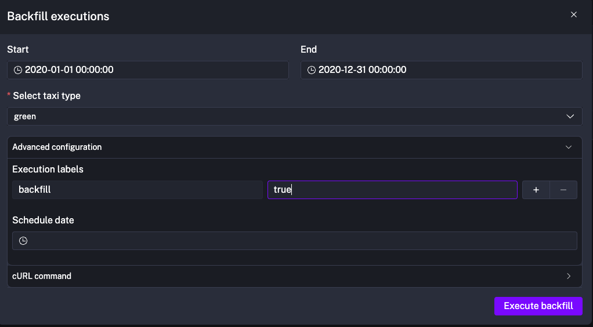

## Q1. ##


## Q2. ##
```
{{inputs.taxi}}_tripdata_{{inputs.year}}-{{inputs.month}}.csv
```
converted to 
```
green_tripdata_2020-04.csv
```

## Q3. ##

I first backfilled the data of the entire year of 2020.


Then query 
```
select count(*) from yellow_tripdata where filename like '%2020%'
```


## Q4. ##

I first backfilled the data of the entire year of 2020.


Then query
```
select count(*) from green_tripdata where filename like '%2020%'
```


## Q5. ##
I added a task in 02_postgres_taxi workflow to count the number of rows in the staging table:
```
- id: yellow_number_of_rows
        type: io.kestra.plugin.jdbc.postgresql.Queries
        sql: SELECT COUNT(*) FROM {{render(vars.staging_table)}}
        fetchType: FETCH_ONE
```


## Q6. ##

