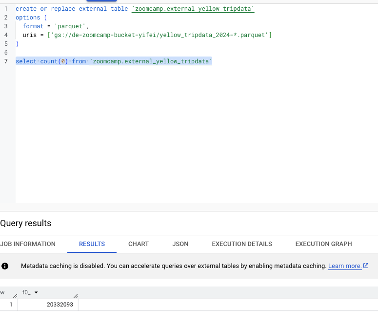
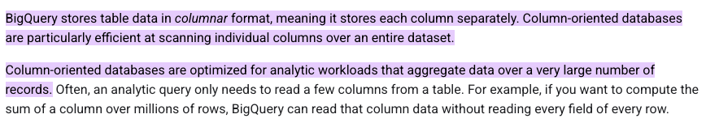
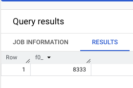

## Q1. ##


## Q2. ##
``` select distinct(PULocationID) from `zoomcamp.external_yellow_tripdata`; ```


```select distinct(PULocationID) from `zoomcamp.yellow_tripdata`; ```


## Q3. ##


## Q4. ##
``` select count(0) from `zoomcamp.yellow_tripdata` where fare_amount = 0 ```


## Q5. ##
The cost of querying data can be reduced if the selected data is filtered based on the partitioning column, while the clustering column helps to sort the data within each partition.

## Q6. ##
```
CREATE OR REPLACE TABLE `zoomcamp.yellow_tripdata_partitioned`
PARTITION BY
  DATE(tpep_dropoff_datetime)
CLUSTER BY VendorID AS
SELECT * FROM `zoomcamp.external_yellow_tripdata`;
```

``` 
select distinct VendorID from `zoomcamp.yellow_tripdata` 
where tpep_dropoff_datetime >= '2024-03-01' and tpep_dropoff_datetime <='2024-03-15' 
```


```
select distinct VendorID from `zoomcamp.yellow_tripdata_partitioned` 
where tpep_dropoff_datetime >= '2024-03-01' and tpep_dropoff_datetime <='2024-03-15'
```


## Q7. ##
Stored in GCP bucket as the uri starts with 'gs://'

## Q8. ##
For a small dataset, clustering does not bring any obvious performance improvement. Also, for columns with low cardinality, clustering based on them would not give benefits and may even increase the costs due to extra overhead for managing the metadata.