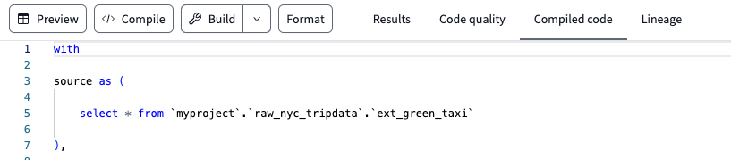
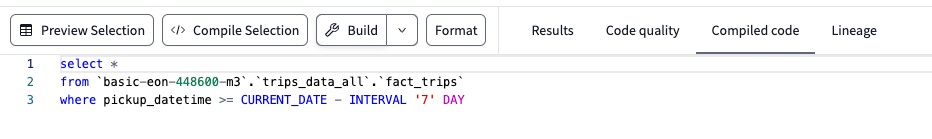
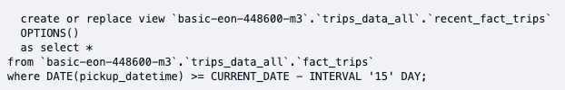
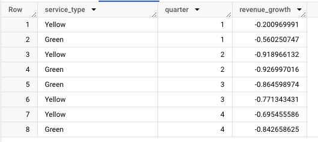
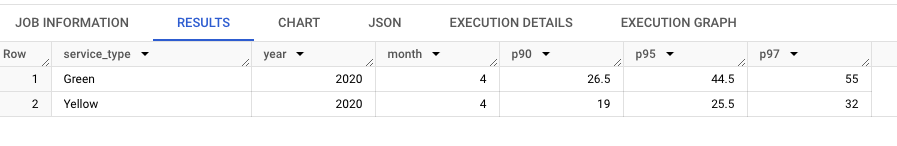
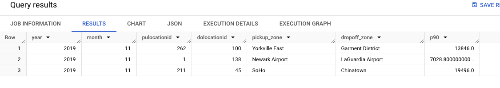

## Q1. ##


## Q2. ##
```
select *
from {{ ref('fact_trips') }}
where pickup_datetime >= CURRENT_DATE - INTERVAL '{{ var("days_back", env_var("DBT_DAYS_BACK", "30")) }}' DAY
```
After setting the env var `DBT_DAYS_BACK = 7` only, the compiled code is:


Then after setting the var `days_back` by running
```
dbt build --select recent_fact_trips --vars '{'days_back': 15}'
```
We have


## Q3. ##
`dbt run --select models/staging/+` runs only staging models so it does not reach `fct_taxi_monthly_zone_revenue`

## Q4. ##
If `DBT_BIGQUERY_STAGING_DATASET` is not set, it falls back to `DBT_BIGQUERY_TARGET_DATASET` when the model type is not `core`. So even if `DBT_BIGQUERY_STAGING_DATASET` is not set, it won't fail.


## Q5. ##
I build the `fct_taxi_trips_quarterly_revenue` as follows:
```
{{
    config(
        materialized='table'
    )
}}

SELECT 
    EXTRACT(YEAR FROM pickup_datetime) AS year,
    EXTRACT(QUARTER FROM pickup_datetime) AS quarter,
    CONCAT(EXTRACT(YEAR FROM pickup_datetime), '-Q', EXTRACT(QUARTER FROM pickup_datetime)) AS year_quarter,
    service_type,
    SUM(total_amount) AS quarterly_total_amount  -- Aggregating revenue
FROM {{ ref('fact_trips') }}
GROUP BY 1, 2, 3, 4
ORDER BY 1, 2, 4
```
and `yoy_revenue_growth` as
```
create or replace table trips_data_all.yoy_revenue_growth as 

with y2019 as (
  select *
  from `basic-eon-448600-m3.trips_data_all.fct_taxi_trips_quarterly_revenue`
  where year = 2019
),

y2020 as (
  select *
  from `basic-eon-448600-m3.trips_data_all.fct_taxi_trips_quarterly_revenue`
  where year = 2020
)

SELECT l.service_type,
       l.quarter,
       (r.quarterly_total_amount - l.quarterly_total_amount) / l.quarterly_total_amount as revenue_growth
from y2019 l
join y2020 r
on l.service_type = r.service_type and l.quarter = r.quarter
```
The data is displayed as:



## Q6. ##
The model `fct_taxi_trips_monthly_fare_p95.sql` is written as:
```
{{
    config(
        materialized='table'
    )
}}

select 
    service_type,
    extract(year from pickup_datetime) as year,
    extract(month from pickup_datetime) as month,
    APPROX_QUANTILES(fare_amount, 100)[OFFSET(90)] AS p90,
    APPROX_QUANTILES(fare_amount, 100)[OFFSET(95)] AS p95,
    APPROX_QUANTILES(fare_amount, 100)[OFFSET(97)] AS p97
from {{ ref('fact_trips') }}
where extract(year from pickup_datetime) = 2020 and
extract(month from pickup_datetime) = 4 and
fare_amount > 0 and trip_distance > 0 and
payment_type_description in ('Cash', 'Credit card')
group by 1, 2, 3
```


## Q7. ##
stg_fhv_data.sql
```
with 

source as (

    select * from {{ source('staging', 'fhv_data') }}

),

renamed as (

    select
        dispatching_base_num,
        pickup_datetime,
        dropoff_datetime,
        cast(pulocationid as integer) as pulocationid,
        cast(dolocationid as integer) as dolocationid,
        sr_flag,
        affiliated_base_number

    from source

    where dispatching_base_num is not null

)

select * from renamed
```

dim_fhv_trips.sql
```
{{
    config(
        materialized='table'
    )
}}


with dim_zones as (
    select * from {{ ref('dim_zones') }}
    where borough != 'Unknown'
)

select trips.*,
       extract(year from trips.pickup_datetime) as year,
       extract(month from trips.pickup_datetime) as month,
       pickup_zone.borough as pickup_borough, 
       pickup_zone.zone as pickup_zone, 
       dropoff_zone.borough as dropoff_borough, 
       dropoff_zone.zone as dropoff_zone
from {{ ref('stg_fhv_data') }} trips
inner join dim_zones pickup_zone
on trips.pulocationid = pickup_zone.locationid
inner join dim_zones dropoff_zone
on trips.dolocationid = dropoff_zone.locationid
```

fct_fhv_monthly_zone_traveltime_p90
```
{{
    config(
        materialized='table'
    )
}}

with time_diff as(
    select *,
          TIMESTAMP_DIFF(dropoff_datetime, pickup_datetime, second) as trip_duration
    from {{ ref('dim_fhv_trips') }}
),
p90_partition as (
select year,
       month,
       pulocationid,
       dolocationid,
       pickup_zone,
       dropoff_zone,
       PERCENTILE_CONT(trip_duration, 0.9) over (partition by year, month, pulocationid, dolocationid) as p90
from time_diff
)

select year,
       month,
       pulocationid,
       dolocationid,
       pickup_zone,
       dropoff_zone,
       max(p90) as p90
from p90_partition
group by 1, 2, 3, 4, 5, 6
```

Query for 2nd longest p90:
```
select *
from `trips_data_all.fct_fhv_monthly_zone_traveltime_p90`
where year = 2019 and month = 11 and pickup_zone in ('Newark Airport','SoHo', 'Yorkville East')
qualify row_number() over(partition by pickup_zone order by p90 desc) = 2
```
